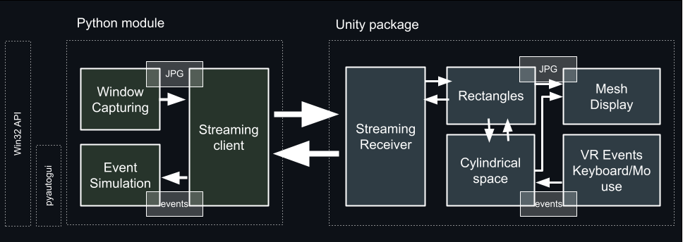

# WindowMirror

WindowMirror toolkit provides users with a simulated, extended screen real-estate. It allows users to interact with multiple desktopapplications in real-time within a XR environment. 
WindowMirror supports traditional desktop interaction methods suchas mouse, and keyboard. 


## Instructions

### Clone or download the repository

```
git clone https://github.com/google/window-mirror.git
```
### Python Module Setup
* Install all requirements for the python module 
```
pip install -r requirements.txt
```
* Optionally test the python module locally by following this [instructions](python/README.md).

### Unity
* In your unity project go to Window → Package Manager. Click the + button at the top left and select Add package from disk pointing at package.json

```
unity-package/package.json 
```

* Once the Package Manager has installed the package, import the sample scene 'Editor Screen Testing'.
* Optionally test the unity project/python module locally by following this [Instructions](unity-package/README.md).
* Add your XR camera rig. Build and deploy your application.

###  Start Streaming Windows

* Ensure your headset and Windows machine are connected to the same network. Some networks do not allow peer-to-peer communication. If you encounter issues, consider using a hotspot.

* Retrieve Your Headset IP. This is needed to establish a connection.

* Configure Streaming Client. Open streaming_client.py.  Set the IP address of your headset at line 264 by replacing "127.0.0.1" with the actual IP address of your headset.
```
ip = "127.0.0.1"
```

* Run Streaming Client. Open a terminal on your Windows machine. Run the streaming client by executing:
```
python streaming_client.py
```
* Follow instructions on the terminal to start the straming of an open window.

## System Architecture

Our architecturehas two main modules: a Unity package and a Python backend. 




## Cite

If you use this software, in your research, please cite the following paper:

```bibtex
@inproceedings{Bovo2024,
    author    = {Riccardo Bovo and Eric J. Gonzalez and Li-Te Cheng and Mar Gonzalez-Franco},
    title     = {WindowMirror: An Open-Source Toolkit to Bring Interactive Multi-Window Views into XR},
    booktitle = {Proceedings of the IEEE VR Conference 2024},
    year      = {2024},
    address   = {Florida},
    url       = {https://github.com/google/window-mirror}
}
```

## Contributors

 - **Riccardo Bovo (Imperial College London)** - Student Researcher at Google AR & VR 
 - **Li-Te Cheng (Google AR & VR)** 
 - **Mar Gonzalez-Franco (Google AR & VR)** 
 - **Eric J Gonzalez (Google AR & VR)** 
